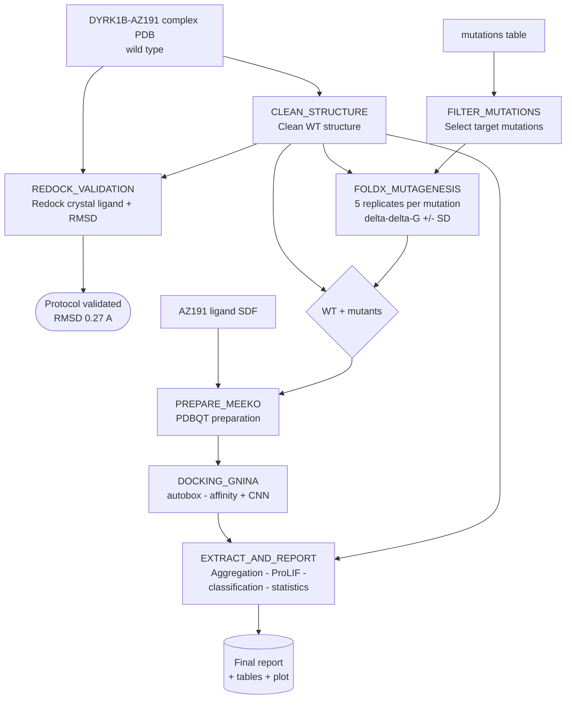

# Predicting the Effect of DYRK1B Mutations on AZ191 Inhibitor Binding

> A reproducible **Nextflow** pipeline that combines *in silico* mutagenesis (**FoldX**) and molecular docking (**GNINA**) to predict how point mutations in the kinase **DYRK1B** affect the binding affinity of the inhibitor **AZ191**.

This repository contains the code developed for a **Master's Thesis (Trabajo de Fin de Máster, TFM)**.

---

## Table of contents

- [Overview](#overview)
- [Biological background](#biological-background)
- [Scientific approach](#scientific-approach)
- [Pipeline architecture](#pipeline-architecture)
- [Workflow diagram](#workflow-diagram)
- [Repository structure](#repository-structure)
- [Requirements](#requirements)
- [Installation](#installation)
- [Input data](#input-data)
- [Running the pipeline](#running-the-pipeline)
- [Configuration parameters](#configuration-parameters)
- [Outputs and how to read them](#outputs-and-how-to-read-them)
- [Methodological notes](#methodological-notes)
- [Reproducibility](#reproducibility)
- [Authorship](#authorship)

---

## Overview

The goal of this project is to **predict the effect of point mutations in DYRK1B on the binding of its inhibitor AZ191**, using two complementary computational approaches that are reported separately:

1. **Structure-based *in silico* mutagenesis** with **FoldX**, which generates the structural models of each mutant and estimates the change in folding stability (ΔΔG).
2. **Molecular docking** of AZ191 onto the wild-type (WT) protein and each mutant with **GNINA**, which estimates binding affinity.

The whole workflow is orchestrated with **Nextflow (DSL2)**, providing reproducibility, modularity, caching, and the ability to resume interrupted runs (`-resume`).

A distinctive feature of this pipeline is its emphasis on **scientific rigour**: it includes a docking validation control (redocking), statistical replicates for stability estimates, fixed random seeds for reproducibility, a consistent docking-box definition shared by validation and production runs, and a protein–ligand interaction analysis to explain the results mechanistically.

---

## Biological background

**DYRK1B** (*Dual-specificity tyrosine-phosphorylation-regulated kinase 1B*) is a kinase involved in cell-cycle regulation, quiescence, and cell survival. It is a therapeutic target of interest in oncology and metabolic disease. **AZ191** is a selective small-molecule inhibitor of DYRK1B.

Mutations in the kinase domain can alter the geometry of the binding site and therefore modify inhibitor affinity — a common mechanism of drug resistance. This pipeline **quantifies that impact computationally and a priori**, distinguishing mutations that destabilise the protein fold from those that primarily disrupt inhibitor binding.

---

## Scientific approach

For each mutation the pipeline answers two independent questions:

- **Does the mutation destabilise the protein?** → measured by FoldX as ΔΔG of folding stability (kcal/mol), with 5 replicates per mutation to quantify uncertainty.
- **Does the mutation impair inhibitor binding?** → measured by GNINA as the change in docking affinity relative to the WT (kcal/mol), with the binding-pose confidence reported via the CNN score.

Crucially, these two magnitudes are **kept separate** throughout the analysis (they measure different physical properties), and each mutation is finally **classified** by which of the two it affects: stability, binding, both, or neither.

---

## Pipeline architecture

The workflow is split into independent **Nextflow processes**, defined in `main.nf` and `modules/`:

| Process | Module | Role |
|---------|--------|------|
| `FILTER_MUTATIONS` | `modules/01_filter_data.nf` | Selects the mutations of interest from the input mutation table. |
| `CLEAN_STRUCTURE` | `modules/02_clean_structure.nf` | Cleans and prepares the WT protein structure. |
| `REDOCK_VALIDATION` | `modules/00_validate_docking.nf` | **Validation control:** redocks the crystallographic AZ191 onto the WT and computes RMSD vs the native pose. |
| `FOLDX_MUTAGENESIS` | `modules/03_mutagenesis.nf` | Generates mutant structures with FoldX (5 replicates per mutation) and computes ΔΔG ± SD. |
| `PREPARE_MEEKO` | `modules/04_prepare_meeko.nf` | Prepares receptors and ligand in PDBQT format (Meeko). |
| `DOCKING_GNINA` | `modules/05_docking_gnina.nf` | Docks AZ191 onto WT and each mutant replica with GNINA, using the same box strategy as the validation. |
| `EXTRACT_AND_REPORT` | `modules/06_analysis.nf` | Aggregates affinities and CNN scores, runs the interaction analysis (ProLIF), classifies mutations, computes statistics and generates the final report. |

---

## Workflow diagram



---

## Repository structure

```
TFM/
├── bin/                       # Python helper scripts called by the processes
│   ├── filter_mutations.py    #   Filter GDC missense mutations within the kinase domain
│   ├── clean_pdb_foldx.py     #   Strict PDB cleaner for FoldX 4 compatibility
│   ├── run_foldx.py           #   FoldX replicate execution + delta-delta-G aggregation
│   ├── calc_rmsd.py           #   RMSD calculation for redocking validation
│   └── generate_report.py     #   Final report, interactions, statistics
├── modules/                   # Nextflow processes (one per stage)
│   ├── 00_validate_docking.nf
│   ├── 01_filter_data.nf
│   ├── 02_clean_structure.nf
│   ├── 03_mutagenesis.nf
│   ├── 04_prepare_meeko.nf
│   ├── 05_docking_gnina.nf
│   └── 06_analysis.nf
├── raw_data/                  # Input data (NOT version-controlled)
│   ├── DYRK1B_AZ191_complex.pdb
│   ├── AZ191.sdf
│   └── DYRK1B_mutations.tsv
├── results/                   # Pipeline outputs
├── main.nf                    # Main workflow definition
├── nextflow.config            # Resources, parameters, profiles
├── environment.yml            # Conda environment (pinned dependency versions)
├── .gitignore
├── README.md
└── LICENSE
```

### Helper scripts (`bin/`)

Each Nextflow process delegates its actual work to a Python script in `bin/` (Nextflow exposes this directory on the `PATH` automatically):

| Script | Called by | What it does |
|--------|-----------|--------------|
| `filter_mutations.py` | `FILTER_MUTATIONS` | Reads the GDC mutation TSV, keeps only **missense** variants, restricts them to the DYRK1B kinase domain (residues 78–442), sorts by the number of affected cases and writes the top *N* (`-n`, default 3) to `filtered_mutations.csv`. |
| `clean_pdb_foldx.py` | `CLEAN_STRUCTURE` | Strict PDB cleaner for FoldX 4: keeps only the first chain and the primary alternate conformation, maps modified residues to their standard counterparts (e.g. `PTR`→`TYR`, `SEP`→`SER`, `TPO`→`THR`, `MSE`→`MET`, `CSO`→`CYS`), drops any remaining non-standard molecules and pads every line to a strict 80-column width. |
| `run_foldx.py` | `FOLDX_MUTAGENESIS` | Runs FoldX `RepairPDB` on the WT and then `BuildModel` for each mutation with `--runs` replicas (default 5). Parses the `Dif_` output into per-mutation replicate CSVs (`*_ddg_replicas.csv`), aggregates mean ± SD into `foldx_ddg_summary.csv`, and renames the replicate models to the `*_mutant.pdb` pattern expected downstream. |
| `calc_rmsd.py` | `REDOCK_VALIDATION` | Computes the RMSD between the best redocked pose and the crystallographic reference ligand using RDKit `GetBestRMS` (heavy atoms only, symmetry-aware). Assigns bond orders from the ligand template, writes `redocking_validation.txt` and **exits with an error if RMSD exceeds the threshold**, halting the pipeline. |
| `generate_report.py` | `EXTRACT_AND_REPORT` | Parses GNINA Vina/CNN scores, aggregates docking replicas, runs the ProLIF interaction analysis, classifies each mutation (stability / binding / both / neither), runs the FoldX replica statistics (Shapiro-Wilk + t-test/Wilcoxon) and emits the Markdown report, the ΔΔG plot, the interactions table and the ChimeraX visualisation script. |

---

## Requirements

| Tool | Purpose | Notes |
|------|---------|-------|
| [Nextflow](https://www.nextflow.io/) (>= 22.x, DSL2) | Workflow orchestration | Tested with 25.10.x |
| [Conda](https://docs.conda.io/) / Mamba | Environment management | `conda.enabled = true` |
| [FoldX](https://foldxsuite.crg.eu/) 4 | *In silico* mutagenesis | Academic licence; requires `rotabase.txt` |
| [GNINA](https://github.com/gnina/gnina) | Molecular docking | Requires CUDA-capable **GPU** |
| [Meeko](https://github.com/forlilab/Meeko) | Receptor/ligand preparation | Produces PDBQT |
| [ProLIF](https://prolif.readthedocs.io/) | Protein-ligand interaction fingerprints | Used in the analysis step |
| [RDKit](https://www.rdkit.org/) | Cheminformatics (RMSD, bond orders) | |
| SciPy / pandas / matplotlib | Statistics and plotting | |
| Python >= 3.10 | Helper scripts | |

> **FoldX** requires a free academic licence and must be installed manually and available on the `PATH`. Its `rotabase.txt` data file is currently referenced by an absolute path in `modules/03_mutagenesis.nf`; adjust that path to point to your local copy.
>
> **Graphviz** is optional; install it if you want Nextflow to render the execution DAG and HTML reports (`sudo apt install graphviz`).

---

## Installation

```bash
# 1. Clone the repository
git clone https://github.com/JSoriano02/TFM.git
cd TFM

# 2. Install Nextflow if needed
curl -s https://get.nextflow.io | bash

# 3. Dependencies are resolved automatically via Conda
#    (conda.enabled = true in nextflow.config); the pinned
#    versions are documented in environment.yml
```

FoldX and its `rotabase.txt` must be installed separately; adjust the `rotabase.txt` path in `modules/03_mutagenesis.nf`.

---

## Input data

The pipeline expects the following files in `raw_data/`:

| File | Description |
|------|-------------|
| `DYRK1B_AZ191_complex.pdb` | Crystallographic structure of the DYRK1B-AZ191 complex (wild type). |
| `AZ191.sdf` | Structure of the AZ191 inhibitor (ligand). |
| `DYRK1B_mutations.tsv` | GDC-format mutation table (columns `consequence`, `protein_change`, `num_ssm_affected_cases`, …) from which the top missense mutations are selected. |

These files are **not included** in the repository. The crystallographic ligand is identified internally by its residue name (`QS0`); the complex also contains manganese ions (`MN`) and a phosphotyrosine residue (`PTR`), which are filtered out when the ligand is extracted.

---

## Running the pipeline

```bash
# Standard run (local executor with GPU)
nextflow run main.nf

# Resume an interrupted run without recomputing completed steps
nextflow run main.nf -resume
```

---

## Configuration parameters

Defined in `nextflow.config` and overridable from the command line (`--parameter`):

| Parameter | Default | Description |
|-----------|---------|-------------|
| `raw_dir` | `${projectDir}/raw_data` | Input data directory. |
| `outdir` | `${projectDir}/results` | Output directory. |
| `wt_pdb` | `${raw_dir}/DYRK1B_AZ191_complex.pdb` | Crystallographic WT complex PDB. |
| `ligand` | `${raw_dir}/AZ191.sdf` | AZ191 ligand structure (SDF). |
| `mutations_tsv` | `${raw_dir}/DYRK1B_mutations.tsv` | GDC mutation table (defined in `main.nf`). |
| `ligand_resname` | `QS0` | Residue name of the crystallographic ligand. |
| `foldx_runs` | `5` | FoldX replicates per mutation. |
| `seed` | `42` | Random seed for GNINA (reproducibility). |
| `exhaustiveness` | `16` | GNINA search exhaustiveness. |
| `num_modes` | `9` | Number of docking poses generated. |
| `rmsd_threshold` | `2.0` | Redocking validation threshold (Angstrom). |
| `ddg_stability_threshold` | `0.5` | abs(delta-delta-G) relevance threshold (kcal/mol). |
| `delta_affinity_threshold` | `0.5` | abs(delta-affinity) relevance threshold (kcal/mol). |

**Docking box.** The search box is defined automatically via GNINA's `--autobox_ligand` (with `--autobox_add 4`) around the crystallographic ligand position. The **same box strategy is applied consistently** in both the redocking validation (`REDOCK_VALIDATION`) and the mutant docking (`DOCKING_GNINA`), so the validated protocol is exactly the one used to produce the mutant results. The legacy `box_x/y/z` and `box_size` parameters that remain in `nextflow.config` are **no longer used** by the docking processes and are kept only for reference.

> Resources (executor, CPUs, memory) and the `gpu_intensive` label (`maxForks = 1`, tuned for a 6 GB GPU) are also set in `nextflow.config`.

---

## Outputs and how to read them

After a successful run, `results/` contains numbered subdirectories that mirror the pipeline stages
(`00_validation/`, `02_cleaned/`, `03_mutants/`, `04_prepared/`, `05_docking/`, `06_analysis/`), plus a
`reports/` directory with the Nextflow execution report, trace, timeline and DAG. The key outputs are:

| Output | Location | What it tells you |
|--------|----------|-------------------|
| `redocking_validation.txt` | `00_validation/` | RMSD of the redocked AZ191 vs the native pose. **Read this first:** the protocol passes with RMSD ≈ 0.27 Å, well below the 2 Å threshold, confirming the docking method reproduces the crystallographic pose. |
| `foldx_ddg_summary.csv` | `03_mutants/` | delta-delta-G of folding stability per mutation (mean +/- SD over replicates). |
| `*_ddg_replicas.csv` | `03_mutants/` | Raw per-replicate delta-delta-G values for each mutation. |
| `ddg_stability_plot.png` | `06_analysis/` | Bar chart of delta-delta-G with error bars. |
| `interactions_table.csv` | `06_analysis/` | ProLIF protein-ligand interactions (H-bonds, hydrophobic contacts, etc.) for WT and mutants. |
| `thermodynamic_report.md` | `06_analysis/` | Final report. Aggregated tables: binding affinity (GNINA Vina score **and CNN pose-confidence score**), folding stability (FoldX), mutation classification, replicate statistics and a traceability section (tool versions, seed, thresholds). |
| `visualize_interactions.cxc` | `06_analysis/` | ChimeraX command script to visualise the docked poses and receptor-ligand H-bonds. |

**Reading suggestion:** the WT structure is the reference row in every table. The *change* in affinity for each mutant relative to the WT is the key comparison — a positive delta-affinity means weaker binding. The **CNN score** indicates how confident the model is that a pose resembles a native binding mode (values near 1 = high confidence); it should be checked to confirm that mutant poses are reliable. Combine binding affinity with the FoldX delta-delta-G to determine whether a mutation acts on stability, on binding, or on both.

---

## Methodological notes

- **Stability vs binding are different magnitudes.** FoldX delta-delta-G quantifies folding stability; GNINA affinity quantifies ligand binding. They are reported separately and never combined into a single score.
- **Replicates and uncertainty.** FoldX is run with 5 replicates per mutation so that every delta-delta-G carries a standard deviation; one-sample statistical tests are reported against H0: delta-delta-G = 0.
- **Statistical vs biological significance.** These are treated as independent concepts: a result can be statistically significant without exceeding the biological relevance threshold (abs(delta-delta-G) > 0.5 kcal/mol), and vice versa.
- **Docking validation.** Before trusting any mutant result, the protocol is validated by redocking the native ligand and checking RMSD < 2 Å against the crystallographic pose (achieved: ≈ 0.27 Å).
- **Consistent, robust box definition.** Both the validation and the mutant docking use `--autobox_ligand` centred on the crystallographic ligand, rather than hardcoded coordinates. This guarantees that the validated protocol matches the production protocol and avoids artefacts from a free ligand centred at the origin.
- **Pose confidence.** The GNINA CNN score is reported alongside the Vina affinity so that the reliability of each docked pose can be assessed, not just its predicted energy.

---

## Reproducibility

- All stochastic steps use a fixed seed (`params.seed`); GNINA exhaustiveness and number of modes are explicit parameters.
- The full provenance (tool versions, replicates, thresholds, seed) is recorded in the final report.
- Nextflow caching allows exact resumption with `-resume`; enabling Graphviz additionally produces the execution report, timeline and DAG.

---

## Authorship

**Author:** J. Soriano ([@JSoriano02](https://github.com/JSoriano02))
**Type:** Master's Thesis (Trabajo de Fin de Máster, TFM)
**Year:** 2026

See [`LICENSE`](LICENSE) for licensing terms.