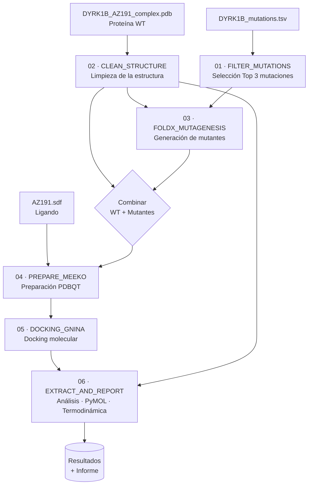

# Predicción del efecto de mutaciones de DYRK1B sobre la unión del inhibidor AZ191

> Pipeline reproducible en **Nextflow** para evaluar, mediante mutagénesis *in silico* y *docking* molecular, cómo determinadas mutaciones de la quinasa **DYRK1B** afectan a la afinidad de unión del inhibidor **AZ191**.

---

## Tabla de contenidos

- [Descripción](#descripción)
- [Contexto biológico](#contexto-biológico)
- [Arquitectura del pipeline](#arquitectura-del-pipeline)
- [Diagrama del flujo de trabajo](#diagrama-del-flujo-de-trabajo)
- [Estructura del repositorio](#estructura-del-repositorio)
- [Requisitos](#requisitos)
- [Instalación](#instalación)
- [Datos de entrada](#datos-de-entrada)
- [Ejecución](#ejecución)
- [Parámetros de configuración](#parámetros-de-configuración)
- [Resultados](#resultados)
- [Notas sobre reproducibilidad y hardware](#notas-sobre-reproducibilidad-y-hardware)
- [Cómo citar](#cómo-citar)
- [Licencia](#licencia)
- [Autoría](#autoría)

---

## Descripción

Este repositorio contiene el código desarrollado como **Trabajo de Fin de Máster (TFM)**. Su objetivo es **predecir el efecto de mutaciones puntuales de la proteína DYRK1B sobre la unión de su inhibidor AZ191**, combinando dos aproximaciones computacionales complementarias:

1. **Mutagénesis dirigida *in silico*** sobre la estructura proteica mediante **FoldX**, para generar los modelos estructurales de las variantes mutadas.
2. **Acoplamiento molecular (*docking*)** del inhibidor AZ191 sobre la proteína silvestre (WT) y sus mutantes mediante **GNINA**, para estimar las energías de unión.

Todo el flujo está orquestado con **Nextflow (DSL2)**, lo que garantiza la reproducibilidad, la modularidad y la posibilidad de reanudar ejecuciones interrumpidas (`-resume`).

---

## Contexto biológico

**DYRK1B** (*Dual-specificity tyrosine-phosphorylation-regulated kinase 1B*) es una quinasa implicada en la regulación del ciclo celular, la quiescencia y la supervivencia celular, y constituye una diana terapéutica de interés en oncología y enfermedades metabólicas. **AZ191** es un inhibidor selectivo de DYRK1B.

Las **mutaciones en el dominio quinasa** pueden alterar la geometría del sitio de unión y, en consecuencia, modificar la afinidad del inhibidor —un mecanismo frecuente de resistencia farmacológica. Este pipeline permite **cuantificar, de forma computacional y a priori, ese impacto** sobre la afinidad de unión, priorizando las variantes de mayor relevancia.

---

## Arquitectura del pipeline

El flujo de trabajo está dividido en **seis módulos** independientes (`modules/`), encadenados en `main.nf`:

| Nº | Módulo | Proceso | Función |
|----|--------|---------|---------|
| 01 | `01_filter_data.nf` | `FILTER_MUTATIONS` | Filtra y selecciona las mutaciones de interés (Top 3) a partir del fichero TSV de mutaciones. |
| 02 | `02_clean_structure.nf` | `CLEAN_STRUCTURE` | Limpia y prepara la estructura PDB de la proteína silvestre (WT). |
| 03 | `03_mutagenesis.nf` | `FOLDX_MUTAGENESIS` | Genera las estructuras mutadas con **FoldX** (una por mutación). |
| 04 | `04_prepare_meeko.nf` | `PREPARE_MEEKO` | Prepara receptores y ligando para el *docking* con **Meeko** (formato PDBQT). |
| 05 | `05_docking_gnina.nf` | `DOCKING_GNINA` | Ejecuta el *docking* del ligando AZ191 sobre WT y mutantes con **GNINA**. |
| 06 | `06_analysis.nf` | `EXTRACT_AND_REPORT` | Extrae afinidades, genera el *script* de PyMOL y la justificación termodinámica del resultado. |

---

## Diagrama del flujo de trabajo



---

## Estructura del repositorio

```
TFM/
├── bin/                      # Scripts auxiliares (Python) invocados por los procesos
├── modules/
│   ├── 01_filter_data.nf
│   ├── 02_clean_structure.nf
│   ├── 03_mutagenesis.nf
│   ├── 04_prepare_meeko.nf
│   ├── 05_docking_gnina.nf
│   └── 06_analysis.nf
├── raw_data/                 # Datos de entrada (no incluidos en el repositorio)
│   ├── DYRK1B_mutations.tsv
│   ├── DYRK1B_AZ191_complex.pdb
│   └── AZ191.sdf
├── results/                  # Salidas generadas por el pipeline
├── main.nf                   # Definición del workflow principal
├── nextflow.config           # Configuración (recursos, parámetros, perfiles)
├── .gitignore
└── README.md
```

> **Nota:** el directorio `raw_data/` no se versiona en el repositorio por el tamaño y la naturaleza de los ficheros. Véase la sección [Datos de entrada](#datos-de-entrada).

---

## Requisitos

| Componente | Uso |
|------------|-----|
| [Nextflow](https://www.nextflow.io/) (≥ 22.x, DSL2) | Orquestación del pipeline |
| [Conda](https://docs.conda.io/) / Mamba | Gestión de entornos |
| [FoldX](https://foldxsuite.crg.eu/) | Mutagénesis *in silico* |
| [GNINA](https://github.com/gnina/gnina) | *Docking* molecular (requiere **GPU**) |
| [Meeko](https://github.com/forlilab/Meeko) | Preparación de receptores/ligandos |
| [PyMOL](https://pymol.org/) | Visualización y generación de figuras |
| Python ≥ 3.9 | Scripts de filtrado y análisis |

> ⚠️ **FoldX** requiere licencia académica (gratuita para uso no comercial). Debe instalarse manualmente y estar disponible en el `PATH`.

---

## Instalación

```bash
# 1. Clonar el repositorio
git clone https://github.com/JSoriano02/TFM.git
cd TFM

# 2. Instalar Nextflow (si no está disponible)
curl -s https://get.nextflow.io | bash

# 3. Crear el entorno (las dependencias se gestionan vía Conda en el config)
#    El pipeline está configurado con `conda.enabled = true`,
#    por lo que Nextflow resolverá los entornos automáticamente.
```

> Se recomienda crear un fichero `environment.yml` con las dependencias exactas (Meeko, RDKit, PyMOL, etc.) para garantizar la reproducibilidad. *(Pendiente de añadir.)*

---

## Datos de entrada

El pipeline espera los siguientes ficheros en `raw_data/`:

| Fichero | Descripción |
|---------|-------------|
| `DYRK1B_mutations.tsv` | Tabla de mutaciones a evaluar. |
| `DYRK1B_AZ191_complex.pdb` | Estructura del complejo DYRK1B–AZ191 (proteína silvestre). |
| `AZ191.sdf` | Estructura del ligando inhibidor AZ191. |

Estos ficheros **no se incluyen** en el repositorio. Deben obtenerse de las fuentes correspondientes (p. ej. PDB, ChEMBL o el material suplementario del TFM) y colocarse en el directorio `raw_data/`.

---

## Ejecución

```bash
# Ejecución estándar (entorno local con GPU)
nextflow run main.nf

# Reanudar una ejecución interrumpida
nextflow run main.nf -resume

# Especificando ficheros de entrada personalizados
nextflow run main.nf \
    --mutations_tsv raw_data/mis_mutaciones.tsv \
    --wt_pdb        raw_data/mi_proteina.pdb \
    --ligand        raw_data/mi_ligando.sdf
```

---

## Parámetros de configuración

Definidos en `nextflow.config` (modificables por línea de comandos con `--parámetro`):

| Parámetro | Valor por defecto | Descripción |
|-----------|-------------------|-------------|
| `raw_dir` | `${projectDir}/raw_data` | Directorio de datos de entrada. |
| `outdir` | `${projectDir}/results` | Directorio de resultados. |
| `wt_pdb` | `DYRK1B_AZ191_complex.pdb` | Estructura de la proteína silvestre. |
| `ligand` | `AZ191.sdf` | Ligando a acoplar. |
| `box_x`, `box_y`, `box_z` | `-19.45`, `-26.67`, `1.54` | Centro de la caja de *docking* (coordenadas del sitio de unión). |
| `box_size` | `20.0` | Tamaño de la caja de *docking* (Å). |

> ⚠️ Las coordenadas de la caja de *docking* deben **ajustarse al sitio de unión real** de la estructura empleada.

**Recursos** (configurables en `nextflow.config`):

- Ejecutor: `local` — 6 CPUs, 12 GB de memoria.
- Los procesos etiquetados como `gpu_intensive` usan `maxForks = 1` para evitar saturar la memoria de la GPU (ajustado para una **NVIDIA RTX 2060**).

---

## Resultados

Tras la ejecución, el directorio `results/` contiene:

- Estructuras mutadas generadas por FoldX.
- Receptores y ligando preparados en formato PDBQT.
- Poses de *docking* y afinidades de unión (WT y mutantes) calculadas por GNINA.
- Un *script* de **PyMOL** para la visualización de las poses.
- La **justificación termodinámica** comparativa entre la proteína silvestre y las mutantes.

---

## Notas sobre reproducibilidad y hardware

- El *docking* con GNINA requiere **GPU compatible con CUDA**. La configuración por defecto está ajustada para una **RTX 2060** (6 GB VRAM); en GPUs con más memoria puede aumentarse `maxForks`.
- `errorStrategy = 'retry'` con `maxRetries = 1` permite tolerar fallos transitorios.
- El uso de Nextflow permite reanudar ejecuciones con `-resume` sin repetir pasos ya completados.

---

## Autoría

**Autor:** J. Soriano ([@JSoriano02](https://github.com/JSoriano02))
**Tipo:** Trabajo de Fin de Máster (TFM)
**Año:** 2025

---
